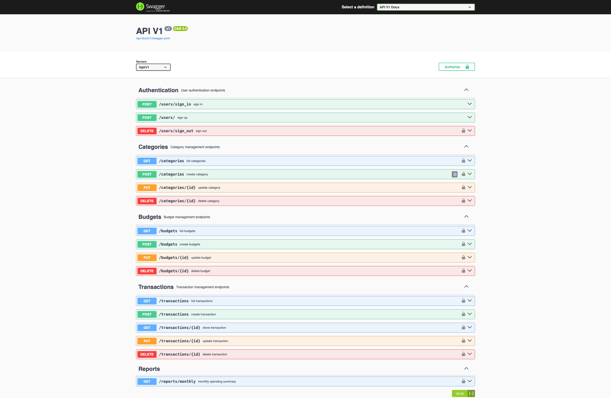

# Personal Finance Tracker API

A Ruby on Rails API for tracking personal finances with budgets, categories, and transactions.

## Table of Contents

- [Getting Started](#getting-started)
- [Testing the API](#testing-the-api)
- [Development](#development)
   - [Code Quality](#code-quality)
   - [Testing](#testing)
- [Tech Stack](#tech-stack)
- [API Endpoints](#api-endpoints)
   - [Authentication](#authentication)
   - [Categories](#categories)
   - [Budgets](#budgets)
   - [Transactions](#transactions)
- [Features](#features)
   - [Budget Monitoring](#budget-monitoring)
- [Status](#status)

## Getting Started

1. **Clone the repository**
   ```bash
   git clone https://github.com/xOviwyRx/personal-finance-tracker.git
   cd personal-finance-tracker
   ```

2. **Build and run with Docker**
   ```bash
   docker-compose up --build
   ```

3. **Set up the database** (in another terminal)
   ```bash
   docker-compose exec web rails db:create db:migrate
   ```

## Testing the API

### Swagger UI Documentation

**Interactive API documentation is available at:** http://localhost:3000/api-docs

Below is a preview of the Swagger UI interface:



The Swagger UI provides:
- Complete API endpoint documentation
- Interactive testing interface
- Request/response examples
- Authentication handling
- Parameter validation

### Authentication Flow

1. **Visit** http://localhost:3000/api-docs
2. **Sign up or sign in** using the authentication endpoints
3. **Copy the JWT token** from the response body
4. **Click "Authorize"** button in Swagger UI
5. **Enter:** `Bearer YOUR_JWT_TOKEN`
6. **Test any endpoint** directly in the browser

## Development

### Code Quality

This project uses **RuboCop** for Ruby code linting and style enforcement:

```bash
# Run RuboCop to check for style violations
docker-compose exec web rubocop

# Auto-fix violations where possible
docker-compose exec web rubocop -a

# Run RuboCop on specific files
docker-compose exec web rubocop app/models/user.rb
```

### Testing

Run the test suite with RSpec:

```bash
# Run all tests
docker-compose exec web rspec

# Run specific test files
docker-compose exec web rspec spec/models/user_spec.rb

# Run tests with coverage report
docker-compose exec web rspec --format documentation

# Run tests for a specific directory
docker-compose exec web rspec spec/requests/
```

## Tech Stack

### Backend
- Ruby 3.1.2+
- Ruby on Rails 7.1.0+ (API-only)
- PostgreSQL
- REST API

### Authentication & Authorization
- Devise
- Devise-JWT (JWT token authentication)
- CanCanCan

### API Documentation
- Swagger UI
- RSwag

### Search & Utilities
- Ransack

### Testing & Code Quality
- RSpec
- RuboCop

### DevOps & Deployment
- Docker & Docker Compose

## API Endpoints

### Authentication
- `POST /api/v1/users` - Sign up (returns JWT token)
- `POST /api/v1/users/sign_in` - Sign in (returns JWT token)
- `DELETE /api/v1/users/sign_out` - Sign out (revokes JWT token)

### Categories
- `GET /api/v1/categories` - List all categories
- `POST /api/v1/categories` - Create a new category
- `PUT /api/v1/categories/:id` - Update a category
- `DELETE /api/v1/categories/:id` - Delete a category

### Budgets
- `GET /api/v1/budgets` - List all budgets
- `POST /api/v1/budgets` - Create a new budget
- `PUT /api/v1/budgets/:id` - Update a budget
- `DELETE /api/v1/budgets/:id` - Delete a budget

### Transactions
- `GET /api/v1/transactions` - List all transactions
- `POST /api/v1/transactions` - Create a new transaction

## Features

### Budget Monitoring
The API includes real-time budget monitoring that provides warnings when creating expense transactions:

- **Budget Exceeded**: Warns when the monthly budget limit is exceeded, showing the overage amount
- **Budget Limit Reached**: Notifies when exactly at the budget limit
- **Approaching Limit**: Alerts when expenses reach 75% of the monthly budget limit

Budget warnings are returned in the transaction creation response:
```json
{
  "transaction": { },
  "warnings": [
    "You have exceeded the budget limit for category 'Food' by 50.0."
  ]
}
```

*Note: The current budget monitoring implementation will be optimized for better performance in future iterations.*

## Status

🚧 Work in Progress
- ✅ User authentication (Devise)
- ✅ Categories CRUD
- ✅ Budgets CRUD
- ✅ Transactions Create & Read
- ✅ User associations and data scoping
- ✅ RSpec tests (Models, Requests)
- ✅ Ransack search functionality (Categories)
- ✅ RSpec tests (Ransack)
- ✅ CanCanCan
- ✅ RSpec tests (CanCanCan)
- ✅ Budget monitoring and warnings
- ✅ Docker containerization
- ✅ RuboCop code linting
- ✅ JWT-Devise
- ✅ Swagger API documentation
- 🔄 Budget monitoring optimization